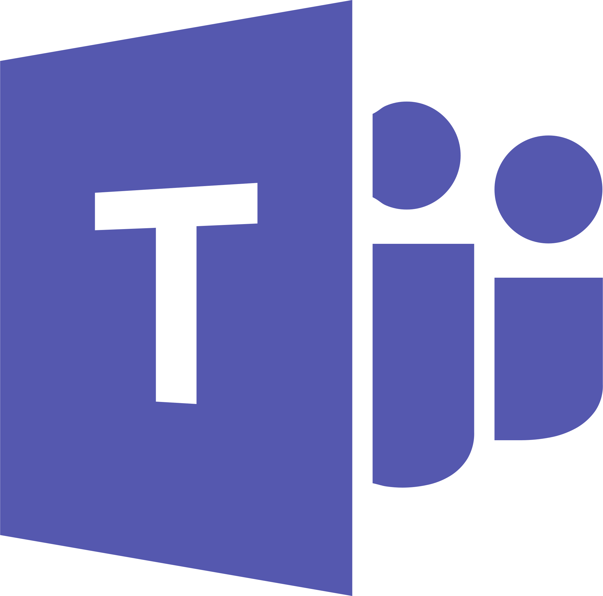
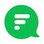

KubeWise is a Slack Bot for Helm. It notifies a Slack channel whenever a Helm chart is installed,
upgraded or uninstalled in your Kubernetes cluster.


# Getting Started

 1. Create a [Slack Bot](https://my.slack.com/services/new/bot).
    - username: `kubewise`
    - name: `KubeWise`
    - icon: `./assets/kubewise-mark-512x512.png`
 2. Save it and grab the API token.
 3. Invite the Bot into your channel by typing `/invite @kubewise` in your Slack channel.
 4. Install KubeWise in your Kubernetes cluster

```
kubectl create clusterrolebinding cluster-self-admin-binding --clusterrole=cluster-admin --serviceaccount=kubewise:default
kubectl create namespace kubewise
helm install kubewise ./helm_chart --namespace kubewise --set slack.token="<api-token>" --set slack.channel="#<channel>"
```

# Supported Chat Apps

| Logo | Name | Supported | Get notified when support is added |
| ------------- | ------------- | ------------ | ------- |
|   | [Slack](https://slack.com)  | ✅ | |
|  | [Microsoft teams](https://products.office.com/en-us/microsoft-teams/group-chat-software) | ⏳ | [Let me know](https://forms.gle/bWJAaaiYArMJ9hrYA) |
|  | [Flock](https://flock.com/) | ⏳ | [Let me know](https://forms.gle/bWJAaaiYArMJ9hrYA) |
|  | [Mattermost](https://mattermost.com) | ⏳ | [Let me know](https://forms.gle/bWJAaaiYArMJ9hrYA) |
|  | [Twist](https://twist.com) | ⏳ | [Let me know](https://forms.gle/bWJAaaiYArMJ9hrYA) |
|  | [Telegram](https://telegram.org) | ⏳ | [Let me know](https://forms.gle/bWJAaaiYArMJ9hrYA) |
