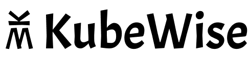

KubeWise is a notifications bot for Helm 3. It notifies your team chat whenever a Helm chart is installed,
upgraded, rolled back or uninstalled in your Kubernetes cluster.

# Get Started

 - [Slack](https://larder.dev/kubewise#slack)
 - [Google Hangouts Chat](https://www.larder.dev/kubewise#google-hangouts-chat)
 - [Webhooks](https://www.larder.dev/kubewise#webhooks)

📣 [Get notified when your tools are supported.](https://forms.gle/bWJAaaiYArMJ9hrYA)

# Documentation

Documentation is hosted at https://www.larder.dev/kubewise
