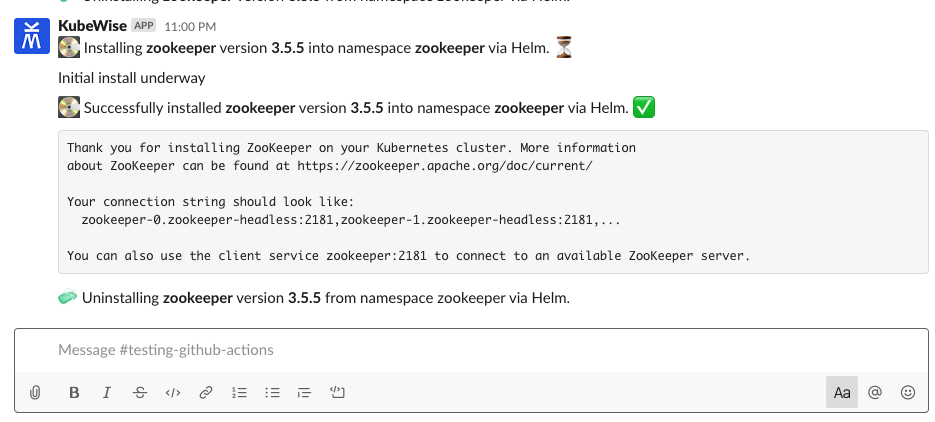

KubeWise is a notifications bot for Helm 3. It notifies your team chat whenever a Helm chart is installed,
upgraded, rolled back or uninstalled in your Kubernetes cluster.


# Supported Applications

| Logo | Name | Supported |  |
| ------------- | ------------- | ------------ | ------- |
|   | [Slack](https://slack.com)  | ✅ | [Get started](#slack) |
|   | [Google Hangouts Chat](https://gsuite.google.com/products/chat/)  | ✅ | [Get started](#google-hangouts-chat) |
|  | Webhooks | ✅ | [Get started](#webhooks) |
|  | [Microsoft teams](https://products.office.com/en-us/microsoft-teams/group-chat-software) | ⏳ |  |

📣 [Get notified when your chosen chat app is supported.](https://forms.gle/bWJAaaiYArMJ9hrYA)

# Getting Started

In general, the getting started process has two steps:

1. Create a bot in your team chat application.
2. Install KubeWise, passing it an API token for the bot.

Sensitive tokens are stored securely in Kubernetes secrets. No data is ever sent to an external API (other
than your chosen team chat app obviously).

## Slack

### How it looks


### Step 1: Create the bot
 1. Create a [Slack Bot](https://my.slack.com/services/new/bot) using Slack's admin controls.
    - username: `kubewise`
    - name: `KubeWise`
    - icon: [Use this PNG file](https://raw.githubusercontent.com/larderdev/kubewise/master/assets/kubewise-mark-blue-512x512.png)
 2. Save it and grab the API token.
 3. Invite the Bot into your channel by typing `/invite @kubewise` in your Slack channel.
 4. Install KubeWise in your Kubernetes cluster. See below.

### Step 2: Install KubeWise
```shell
kubectl create namespace kubewise
helm repo add larder https://charts.larder.dev
helm install kubewise larder/kubewise --namespace kubewise --set handler=slack --set slack.token="<api-token>" --set slack.channel="#<channel>"
```

That's it! From now on, Helm operations will result in a message in your chosen Slack channel.

## Google Hangouts Chat

### How it looks


### Step 1: Create the bot
 1. Open [Hangouts Chat](https://chat.google.com/) in your browser.
 2. Go to the room to which you want to add a bot.
 3. From the dropdown menu at the top of the page, select "Configure webhooks".
 4. Under Incoming Webhooks, click ADD WEBHOOK.
 5. Name the new webhook `KubeWise` and set the Avatar URL to `https://raw.githubusercontent.com/larderdev/kubewise/master/assets/kubewise-mark-blue-512x512.png`.
 6. Click SAVE.
 7. Copy the URL listed next to your new webhook in the Webhook Url column. You will need this later.
 8. Click outside the dialog box to close.

### Step 2: Install KubeWise
```shell
kubectl create namespace kubewise
helm repo add larder https://charts.larder.dev
helm install kubewise larder/kubewise --namespace kubewise --set handler=googlechat --set googlechat.webhookUrl="<webhook-url>"
```

## Webhooks

KubeWise can be used to send a JSON payload to an arbitrary endpoint when a Helm operation
occurs.

### How it looks

```json
{
  "appName": "zookeeper",
  "appVersion": "3.5.5",
  "namespace": "zookeeper",
  "previousAppVersion": "3.2.1",
  "action": "PRE_UNINSTALL",
  "appDescription": "Keep your stuff in the zoo",
  "installNotes": "... truncated notes ..."
}
```

### Step 1: Install KubeWise

```shell
kubectl create namespace kubewise
helm repo add larder https://charts.larder.dev
helm install kubewise larder/kubewise --namespace kubewise --set handler=webhook --set webhook.url="<webhook-url>"
```

The optional parameter `webhook.method` is also supported. It defaults to `POST`.

Basic authentication is supported via the `webhook.authToken="<api-token>"` parameter. It will
add the following header to the request `"Authorization":"Bearer <api-token>"`.

# Using KubeWise from outside a cluster

It is easy to use KubeWise from outside your Kubernetes cluster. It will pick up your local
`kubectl` configuration and use it to speak to your cluster.

First, download a binary from the [Releases page](https://github.com/larderdev/kubewise/releases).
For OS X, you most likely need the `kubewise_0.7.4_Darwin_x86_64.tar.gz` release. Unzip it.

By default, Apple prevents you from running binaries which are downloaded from the internet. To
circumvent this, run the following against the downloaded binary.

```shell
xattr -d com.apple.quarantine ~/path/to/kubewise
```

You should now be able to run it like this:

```shell
env KW_HANDLER=slack KW_SLACK_CHANNEL="#<channel>" KW_SLACK_TOKEN="<api-token>" ~/path/to/kubewise
```

# Multiple clusters in the same channel

It's common for teams to have multiple Kubernetes clusters running such as `staging` and `production`.

KubeWise supports sending the notifications from all of your clusters to one place.
In order to tell the clusters apart, it is a good idea to use the `messagePrefix` feature.

```shell
helm install kubewise larder/kubewise --namespace kubewise --set messagePrefix="\`production\` " --set handler=slack --set slack.token="<api-token>" --set slack.channel="#<channel>"
```

This will produce the following effect:


# Full configuration list

| Parameter | Environment Variable Equivalent | Default | Description |
| ------------- | ------------- | ------------ | ------- |
| `handler` | `KW_HANDLER` | `slack` | The service to send the notifications to. Options are `slack`, `webhook` and `googlechat`. |
| `slack.channel` | `KW_SLACK_CHANNEL` | `#general` | The Slack channel to send notification to when using the Slack handler. |
| `slack.token` | `KW_SLACK_TOKEN` |  | The Slack API token to use. Must be provided by user. |
| `webhook.method` | `KW_WEBHOOK_METHOD` | `POST` | The webhook HTTP method to use. |
| `webhook.url` | `KW_WEBHOOK_URL` |  | The webhook URL to send the request to. |
| `webhook.authToken` | `KW_WEBHOOK_AUTH_TOKEN` |  | An optional Bearer auth header to send with the request. |
| `googlechat.webhookUrl` | `KW_GOOGLECHAT_WEBHOOK_URL` |  | The Google Hangouts Chat URL to use. Must be provided by user. |
| `namespaceToWatch` | `KW_NAMESPACE` | `""` | The cluster namespace to watch for Helm operations in. Leave blank to watch all namespaces. |
| `messagePrefix` | `KW_MESSAGE_PREFIX` |  | A prefix for every notification sent. Often used to identify the cluster (production, staging etc). |
| `chartValuesDiff.enabled` | `KW_CHART_VALUES_DIFF_ENABLED` | `false` | When `true`, KubeWise will log a diff of the chart values when a package is upgraded or rolled back. This is useful for visualizing changes between package versions. Be extremely careful with this feature as it can leak sensitive chart values. |
| `image.repository` | | `us.gcr.io/larder-prod/kubewise` | Image repository |
| `image.tag` | | `<VERSION>` | Image tag |
| `replicaCount` | | `1` | Number of KubeWise pods to deploy. More than 1 is not desirable |
| `image.pullPolicy` | | `IfNotPresent` | Image pull policy |
| `imagePullSecrets` | | `[]` | Image pull secrets |
| `nameOverride` | | `""` | Name override |
| `fullnameOverride` | | `""` | Full name override |
| `rbac.create` | | `true` | Set to false if you would prefer to bring your own RBAC settings. |
| `clusterRole.create` | | `true` | Set to false to use non-cluster role bindings. Can be used in conjunction with `namespaceToWatch` to ensure that KubeWise only reports on changes in a single namespace. |


